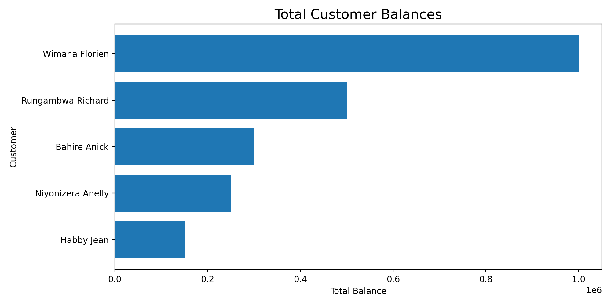
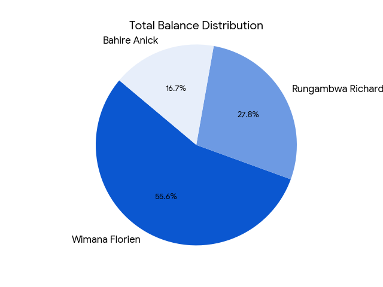
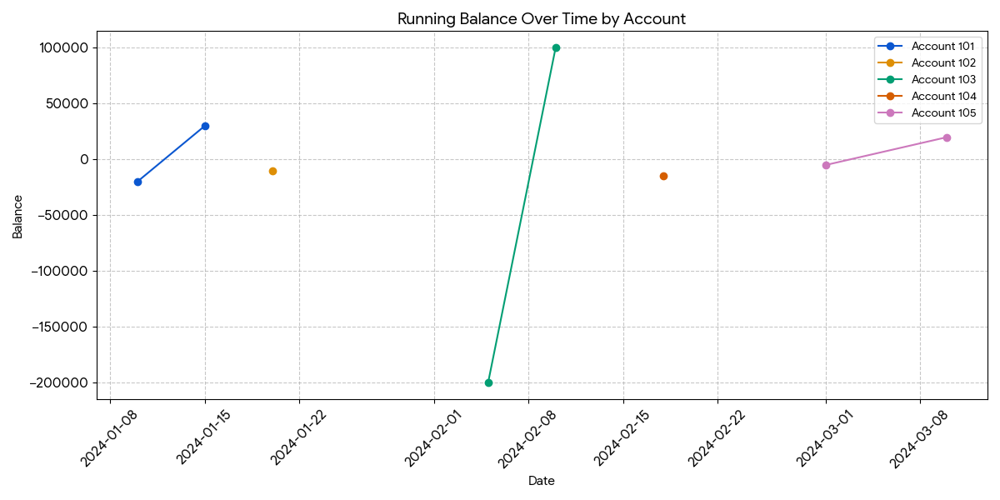
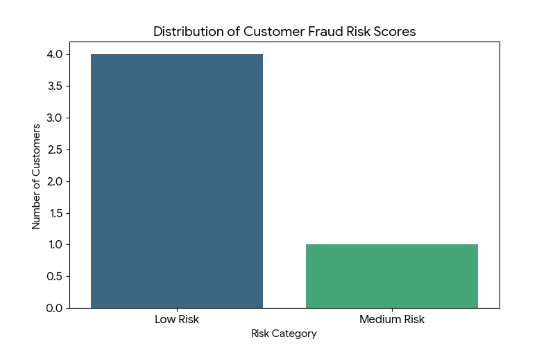
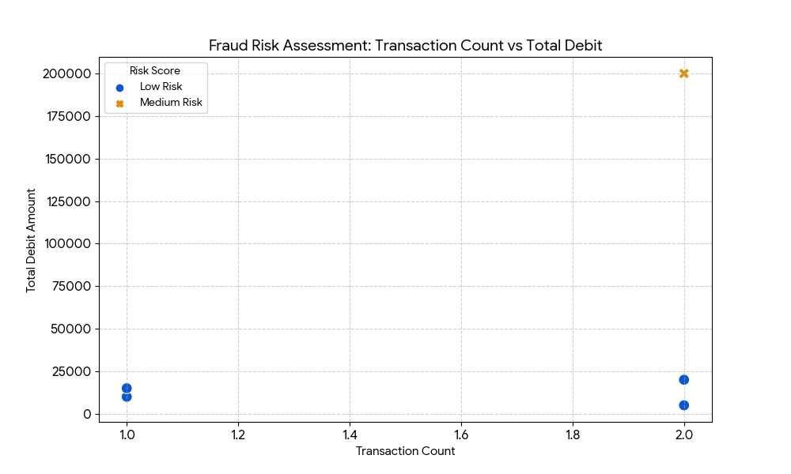

 # Overview

The Banking Transaction Analysis System is an end-to-end Data Engineering portfolio project that simulates real-world banking data workflows. The project demonstrates how raw transactional data can be transformed into meaningful insights using SQL.

This system is designed to analyze customer accounts and transaction data to uncover transaction trends, customer behavior, account activity, and potential fraud indicators.

SQL queries? check them out here: [SQL_Queries_for_this_Project](/Banking_Model_Transaction/)

## Background

Banks generate large volumes of transactional data daily through customer account activities. Analyzing this data efficiently is essential for monitoring account performance, understanding customer behavior, and identifying potential fraud.

The Banking Transaction Analysis System simulates a modern banking analytics workflow by organizing raw transaction data into structured, analytics-ready datasets. Using SQL tools, the project demonstrates how banking data can be processed, analyzed, and transformed into meaningful business insights.
# The questions I wanted to answer through my SQL queries were:

1. Total balance per customer?
2. Monthly deposits vs withdrawals?
3. Top 3 customers by balance?
4. Identify high-risk customers with large debits?
5. Find inactive (dormant) accounts?
6. Running balance per account?

# Tools I Used

For my deep dive into the Banking Transactional Analysis, I harnessed the power of several key tools:

- **SQL:** (Structured Query Language): Enabled me to interact with the database, extract insights, and answer my key questions through queries.
- **PostgreSQL:** As the database management system, PostgreSQL allowed me to store, query, and manipulate the banking transactional data.
- **Visual Studio Code:** This open-source administration and development platform helped me manage the database and execute SQL queries.
- **Git & GitHub:** Essential for version control and sharing MySQL scripts and analysis, ensuring collaboration and project tracking.

# The Analysis

Each query for this project aimed at investigating specific aspects of the banking transactional analysis data. Here’s how I approached each question:

## Total balance per customer 

This analysis provides a consolidated view of each customer’s financial position by aggregating balances across all their associated bank accounts.

``` SQL
SELECT 
    c.full_name,
    SUM(a.balance) AS total_balance
FROM customers c
JOIN accounts a ON c.customer_id = a.customer_id
GROUP BY c.full_name;
```
Here's the breakdown of the Total balance per customer:

In the Banking Transaction Analysis System, this analysis is performed using SQL joins and aggregations between customer and account data. The result enables the bank to:
* Identify customers with the highest overall balances
* Support relationship management and targeted services
* Assess exposure to high-value customers
* Feed downstream analytics and executive dashboards





*Bar graph visualizing the total balance per customer; ChatGPT generated this graph from MySQL query results
*
## Top 3 Customers by Balance

This analysis retrieves the names and aggregate balances of the top three wealthiest customers in the database.
``` SQL
SELECT full_name, total_balance
FROM (
    SELECT 
        c.full_name,
        SUM(a.balance) AS total_balance,
        RANK() OVER (ORDER BY SUM(a.balance) DESC) AS rank_no
    FROM customers c
    JOIN accounts a ON c.customer_id = a.customer_id
    GROUP BY c.full_name
) ranked
WHERE rank_no <= 3;
```
This SQL query is designed to identify the top three customers based on their total combined account balances, The query joins the customers table with the accounts table and calculates the sum of all account balances (SUM(a.balance)) for each customer. and utilizes the RANK() window function to assign a numerical rank to each customer, ordering them from the highest total balance to the lowest.



*Pie chart visualizing the top_3_Customers balance; ChatGPT generated this graph from MySQL query results
*

## Running Balance per Account

This SQL query is designed to calculate a Running Balance (or cumulative balance) for bank accounts by processing individual transaction logs.
```SQL
SELECT
    account_id,
    transaction_date,
    transaction_type,
    amount,
    SUM(
        CASE 
            WHEN transaction_type = 'Credit' THEN amount
            ELSE -amount
        END
    ) OVER (
        PARTITION BY account_id
        ORDER BY transaction_date
        ROWS BETWEEN UNBOUNDED PRECEDING AND CURRENT ROW
    ) AS running_balance
FROM transactions
ORDER BY account_id, transaction_date;
```
The query uses a CASE statement to determine the impact of a transaction. 'Credit' types are treated as positive values, while all other types (e.g., 'Debit' or 'Withdrawal') are treated as negative values. It employs the SUM() window function combined with OVER() to aggregate values dynamically. Resets the calculation for each unique account so balances don't bleed into one another.



*Line chart visualizing the Running_balance-per_account; ChatGPT generated this graph from MySQL query results
*

## Monthly Deposits vs Withdrawals

This SQL query is designed to provide a Monthly Financial Summary, breaking down cash inflows and outflows for each month.
``` SQL
SELECT 
    DATE_TRUNC('month', transaction_date) AS month,
    SUM(CASE WHEN transaction_type = 'Credit' THEN amount ELSE 0 END) AS total_credit,
    SUM(CASE WHEN transaction_type = 'Debit' THEN amount ELSE 0 END) AS total_debit
FROM transactions
GROUP BY DATE_TRUNC('month', transaction_date)
ORDER BY month;
```
- **Time Grouping:** It uses the DATE_TRUNC('month', transaction_date) function to normalize all transaction dates to the first day of their respective month. This ensures that transactions from January 5th and January 20th are grouped under "January."
- **Categorical Summation (Pivoting):** Instead of listing all transactions, the query uses Conditional Aggregation (SUM with CASE statements):

- **total_credit:** Sums the amount only if the type is 'Credit'.

- **total_debit:** Sums the amount only if the type is 'Debit'.
- **Chronological Order:** The results are sorted by the month column to show the financial progression over time.

## Identify Dormant Account(No Transactions in 60 Days)

This SQL query is designed for Inactive Account Detection, specifically identifying accounts that have been dormant for at least 60 days or have never recorded a transaction.
``` SQL
SELECT 
    a.account_id,
    MAX(t.transaction_date) AS last_transaction_date
FROM accounts a
LEFT JOIN transactions t ON a.account_id = t.account_id
GROUP BY a.account_id
HAVING MAX(t.transaction_date) < CURRENT_DATE - INTERVAL '60 days'
    OR MAX(t.transaction_date) IS NULL;
```   

- **Clear Thresholds:** It allows you to draw a "Dormancy Threshold" line (e.g., 60 days). Any bar exceeding this line is immediately identified as a target for intervention.

- **Individual Identification:** By placing account_id on the X-axis, you can see exactly which specific accounts are most inactive.

- **Urgency Ranking:** Sorting the bars from most inactive to least inactive helps prioritize which customers to contact first.


### Visualization Details:
- **X-Axis:** Account ID (treated as a label).

- **Y-Axis:** Days since the last transaction.

- **Visual Cue:** A horizontal red dashed line marks the 60-day threshold.

*Bar chart visualizing the Identification of a Dormant Account; ChatGPT generated this graph from MySQL query results
*

## High Risk Customers With Large Debit Transactions

SQL query designed for High-Risk Fraud Monitoring, specifically flagging large-volume outflows of cash from customers pre-identified as high-risk.

``` SQL
SELECT 
    c.full_name,
    c.risk_category,
    t.amount,
    t.transaction_date
FROM customers c
JOIN accounts a ON c.customer_id = a.customer_id
JOIN transactions t ON a.account_id = t.account_id
WHERE c.risk_category = 'High'
  AND t.transaction_type = 'Debit'
  AND t.amount > 100000;
  ```
 - **Multi-Level Data Linking:** The query performs a double join—linking Customers to their Accounts, and those accounts to their specific Transactions. This provides a full audit trail from the individual's profile to a specific financial event.

- **Risk Filtering:** It specifically targets the high-risk segment, which is typically defined by compliance or credit departments.

- **Behavioral Trigger:** It filters for Debit types to focus on money leaving the bank, rather than incoming deposits.

- **Threshold Enforcement:** It applies a high-value filter (amount > 100000), ensuring that only major movements of capital are flagged for manual review or anti-money laundering (AML) alerts.

## CTEs Example Fraud Suspicion Score

This SQL query is designed for Automated Fraud Risk Profiling. It categorizes customers into different risk tiers based on their transactional behavior and spending volume.

``` SQL
WITH transaction_summary AS (
    SELECT
        a.customer_id,
        COUNT(*) AS txn_count,
        SUM(CASE WHEN t.transaction_type = 'Debit' THEN t.amount ELSE 0 END) AS total_debit
    FROM transactions t
    JOIN accounts a ON t.account_id = a.account_id
    GROUP BY a.customer_id
)
SELECT
    c.full_name,
    ts.txn_count,
    ts.total_debit,
    CASE
        WHEN ts.total_debit > 300000 AND ts.txn_count > 3 THEN 'High Risk'
        WHEN ts.total_debit > 150000 THEN 'Medium Risk.'
        ELSE 'Low Risk'
    END AS fraud_risk_score
FROM transaction_summary ts
JOIN customers c ON ts.customer_id = c.customer_id;
```
### To visualize the Fraud Risk Profiling data, I have created two charts that best demonstrate the relationship between customer activity and their assigned risk level:

- **Scatter Plot (Transaction Count vs. Total Debit):** This is the "perfect" chart for this specific SQL logic because it plots the two variables used in the query's CASE statement. It clearly shows how customers move into "Medium" or "High" risk categories as their debit amounts and transaction counts increase.

- **Risk Distribution Bar Chart:** A summary chart showing how many customers fall into each risk category (Low, Medium, High).





## Visualization Highlights:
- **X-Axis (Scatter):** Number of transactions per customer.

- **Y-Axis (Scatter):** Total dollar amount of debits.

- **Color Coding:** Indicates the fraud_risk_score (e.g., Low, Medium, High) so you can see the clustering of risk groups.

*These charts visualize the CTEs_Example_Fraud_Suspicion_Score; ChatGPT generated this graph from MySQL query results
*

# What I Learned

- To design a normalized relational database with customers, accounts, and transactions.
- To write complex SQL queries using JOINs, aggregations, and CTEs.
- To apply window functions to rank customers and calculate running balances.
- To perform monthly transaction trend analysis and identify dormant accounts.
- Implemented basic fraud and risk detection logic using transaction behavior.
- Optimized query performance with indexing strategies.

# Insights

- Built SQL-driven analytics to identify high-value customers, transaction trends, and seasonal cash-flow patterns from banking data.
- Implemented risk and fraud indicators by detecting dormant accounts and abnormal high-value debit transactions.
- Delivered branch- and city-level datasets optimized for downstream BI reporting and business decision-making.

# Conclusion

This SQL project demonstrates how relational databases and advanced SQL techniques can be used to analyze real-world banking transaction data effectively. By designing a normalized schema and writing optimized queries, the project delivered actionable insights into customer behavior, transaction trends, dormant accounts, and potential fraud indicators.

The solution highlights SQL’s role as a foundational data engineering tool for building reliable, analytics-ready datasets that support risk management, compliance, and executive reporting in financial systems.
